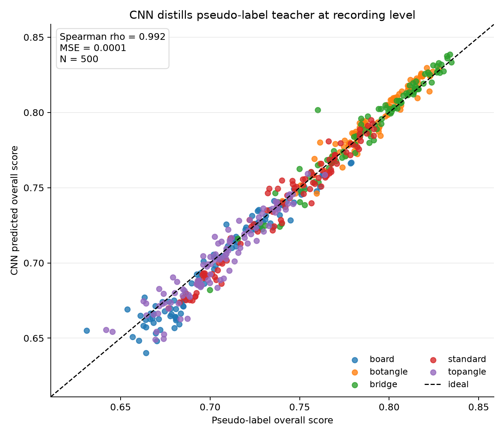
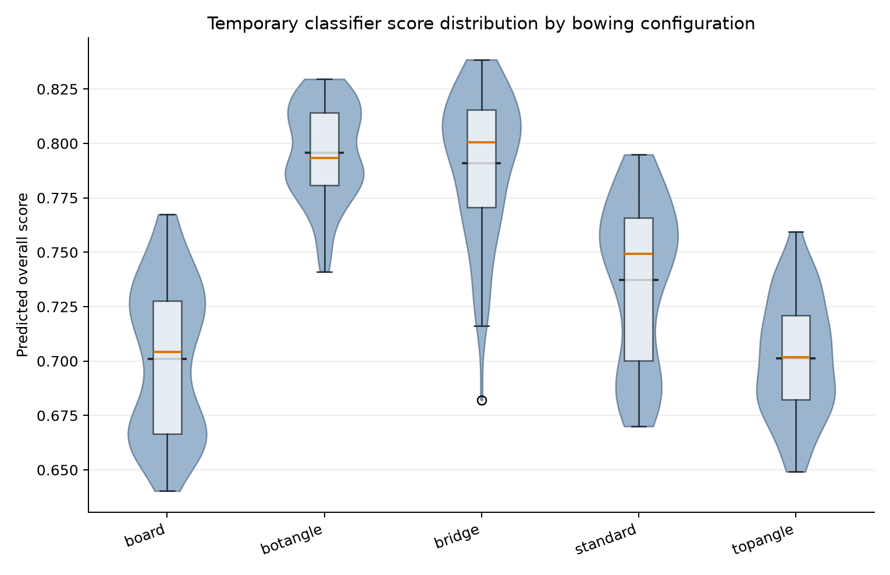
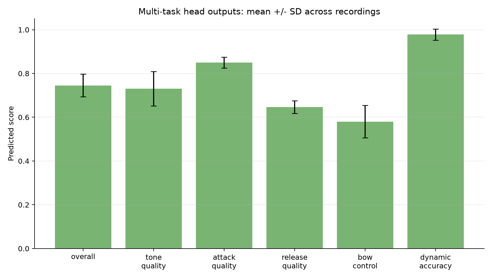
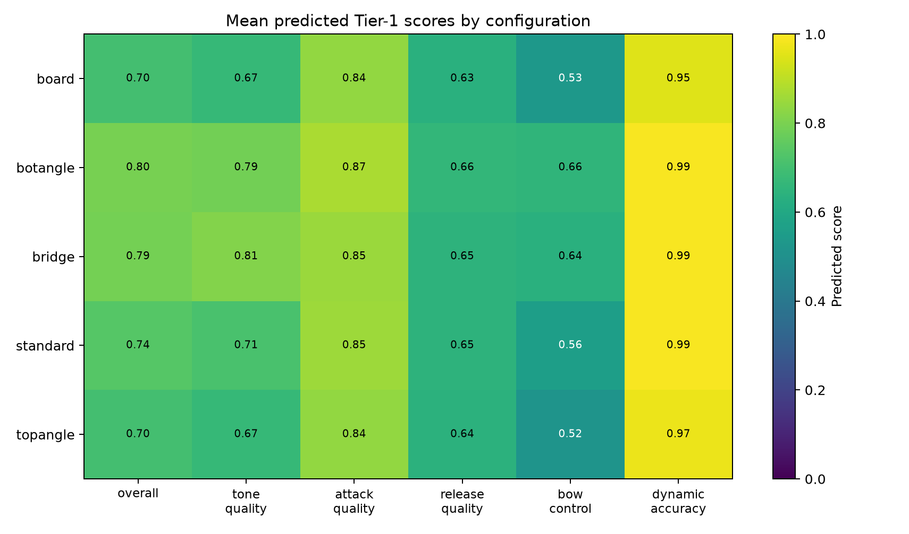

# Temporary Sound Classifier for RL Training

## Executive Summary

We trained a temporary sound-quality classifier for the robot cello using the
current `dataset_a_final` recordings before human annotations are available.
The model follows the intended MelQualityCNN pipeline: it uses audio
spectrograms, scalar audio descriptors, robot physical state, and window
position to predict an overall quality score plus auxiliary technical-quality
scores.

The important distinction is supervision. This version is **not trained on
human ratings**. Instead, it is trained on deterministic pseudo-labels derived
from signal-processing heuristics. That gives us a usable RL reward model now,
while keeping the architecture and deployment contract aligned with the future
human-annotated model.

The saved checkpoint is:

`SoundClassifier/checkpoints/quality_cnn.pt`

It is explicitly marked:

- `schema_version = 2`
- `label_source = pseudo_heuristic_v1`
- `pseudo_labels = True`

This makes it safe to replace later with a human-supervised checkpoint once the
annotation results are imported.

## Why This Was Needed

RL training needs a reward signal before the human annotation pass is complete.
The old fallback heuristic could return a scalar quality score, but it did not
use the full model architecture we plan to deploy. The new temporary classifier
lets RL interact with the same classifier interface and model structure that
will later be trained from human labels.

In other words:

- The RL code can use `BowingQualityClassifier.predict()` immediately.
- The classifier consumes the same runtime inputs expected later.
- The checkpoint can be swapped out after human annotation without changing the
  RL reward interface.

## Model Inputs

Each prediction is made over a 500 ms audio window.

The model receives four input groups:

1. **Log-mel spectrogram**
   - Shape: `(1, 64, 87)`
   - Captures the time-frequency structure of the sound.

2. **Scalar audio features**
   - 40 hand-engineered descriptors.
   - Includes harmonic-to-noise ratio, spectral flatness, pitch stability,
     voiced fraction, envelope stability, attack shape, and MFCC statistics.

3. **Physical state vector**
   - 6 robot-state features.
   - Includes force/depth proxy, force deviation proxy, bow speed, bow
     position, and torque/lateral-force proxies.

4. **Window position**
   - A scalar from 0 to 1.
   - `0` means stroke onset, `1` means release.
   - This lets the model treat attack and release windows differently.

## Model Architecture

The architecture follows the target MelQualityCNN structure except that no
human-annotation head is implemented.

Pipeline:

```text
Audio window
  -> log-mel spectrogram
  -> CNN trunk
  -> time-aware pooling
  -> fused with scalar audio features, physical vector, and window position
  -> multi-task prediction heads
```

The CNN trunk preserves temporal information before pooling. Instead of fully
averaging away time structure, it pools frequency and summarizes time using both
mean and standard deviation. This is important because many quality failures are
time-local: for example, a noisy attack, unstable middle, or weak release.

The current heads predict Tier-1 technical-quality dimensions:

- `overall`
- `tone_quality`
- `attack_quality`
- `release_quality`
- `bow_control`
- `dynamic_accuracy`

The RL reward currently uses `overall`. The detailed outputs are available
through `predict_detailed()` for later reward shaping.

## Pseudo-Labeling Strategy

Because there are no human annotations yet in `dataset_a_final`, the model was
trained using pseudo-labels from deterministic audio/metadata heuristics.

The pseudo-labeler scores each 500 ms window using interpretable signal cues:

- Higher harmonic-to-noise ratio improves quality.
- Lower spectral flatness improves quality.
- Higher voiced fraction improves quality.
- More stable F0 improves quality.
- More stable RMS envelope improves bow-control estimates.
- Cleaner/shorter attack improves attack-quality estimates.
- Speed and audio peak proxies contribute to dynamic-accuracy estimates.

These pseudo-labels are not meant to represent final human preference. They are
a temporary teacher so the CNN can learn a smooth approximation of the current
audio-quality heuristic while using the correct deployment architecture.

## Training Data

Dataset:

`SoundClassifier/Data_Collection/dataset_a_final`

Training set summary:

| Quantity | Value |
|---|---:|
| Recordings | 500 |
| Human-labeled recordings | 0 |
| Pseudo-labeled recordings | 500 |
| Training windows | 7,280 |
| Window duration | 500 ms |
| Hop during training | 250 ms |

The dataset is balanced across five bowing configurations:

- `board`: 100 recordings
- `botangle`: 100 recordings
- `bridge`: 100 recordings
- `standard`: 100 recordings
- `topangle`: 100 recordings

## Training Objective

The model is trained with the same multi-task objective intended for the
human-labeled model:

```text
Loss =
    MSE(overall prediction, overall target)
  + pairwise ranking loss on overall quality
  + auxiliary losses for Tier-1 technical dimensions
```

The ranking term encourages the model to preserve relative quality ordering.
The auxiliary losses help the shared representation encode more than a single
scalar quality estimate.

Attack and release losses are position-weighted:

- Attack quality is supervised most strongly near the start of the stroke.
- Release quality is supervised most strongly near the end of the stroke.
- Middle windows are not forced to explain attack/release events they cannot
  hear.

## Training Results

The checkpoint was trained for 20 epochs on CPU.

Overall recording-level results against the pseudo-label teacher:

| Metric | Value |
|---|---:|
| Recording-level Spearman rho | 0.992 |
| Recording-level MSE | 0.00006 |
| Window-level Spearman rho from training run | 0.983 |
| Ridge baseline recording-level rho | 0.983 |

The CNN slightly outperformed the scalar-feature Ridge baseline against the
pseudo-label target. This is a useful sanity check, but it should not be
over-interpreted because both models are learning from heuristic labels.

Per-configuration recording-level Spearman rho:

| Configuration | Recordings | Spearman rho |
|---|---:|---:|
| board | 100 | 0.956 |
| botangle | 100 | 0.970 |
| bridge | 100 | 0.981 |
| standard | 100 | 0.980 |
| topangle | 100 | 0.956 |

Auxiliary-head agreement against pseudo-labels:

| Head | Spearman rho | MSE |
|---|---:|---:|
| overall | 0.992 | 0.00006 |
| tone_quality | 0.998 | 0.00002 |
| attack_quality | 0.987 | 0.00001 |
| release_quality | 0.957 | 0.00009 |
| bow_control | 0.991 | 0.00011 |
| dynamic_accuracy | 0.663 | 0.00064 |

Dynamic accuracy has lower rank correlation because the pseudo-label values are
clustered very high, leaving little rank variation for the model to learn.

## Generated Figures

The figures are in:

`SoundClassifier/figures/pseudo_classifier_report/`

### Figure 1: Prediction vs pseudo-label



This shows that the CNN closely tracks the pseudo-label teacher at the
recording level. Points are colored by bowing configuration.

### Figure 2: Score distribution by configuration



This shows how the temporary classifier scores vary by bowing configuration.
The plot is useful for checking whether the model collapses all recordings into
one narrow score band or produces meaningful spread.

### Figure 3: Multi-task head summary



This summarizes mean and standard deviation for each predicted Tier-1 score.
It highlights that the model outputs detailed technical scores, not only a
single scalar reward.

### Figure 4: Tier-1 score heatmap by configuration



This visualizes configuration-level differences across all Tier-1 heads. It is
most useful as a diagnostic view for reward shaping and dataset balance.

## How RL Uses It

The RL system can load the classifier through the existing interface:

```python
from SoundClassifier.classifier import BowingQualityClassifier

classifier = BowingQualityClassifier()
score = classifier.predict(audio_chunk, physical_params, string="A")
```

The return value is a single `overall` score in `[0, 1]`, matching the current
reward expectation.

For future detailed reward shaping:

```python
detailed = classifier.predict_detailed(audio_chunk, physical_params, string="A")
```

This returns:

```python
{
    "overall": ...,
    "tone_quality": ...,
    "attack_quality": ...,
    "release_quality": ...,
    "bow_control": ...,
    "dynamic_accuracy": ...,
}
```

## What This Classifier Is Good For

This checkpoint is appropriate for:

- Exercising the RL reward pipeline before annotations are complete.
- Producing a smoother reward signal than a hand-written scalar heuristic.
- Testing the full MelQualityCNN inference path in deployment.
- Validating feature extraction, checkpoint loading, and model inference.

## What This Classifier Is Not Yet Good For

This checkpoint should not be presented as a final perceptual-quality model.

Limitations:

- It has not learned from human judgments.
- It can only learn the biases built into the pseudo-label heuristic.
- The validation metrics are teacher-distillation metrics, not ground-truth
  perceptual metrics.
- The dataset currently has no `bad_*` examples, so bad-condition separation
  could not be evaluated.
- Dynamic-accuracy labels are clustered near 1.0, so that head has limited
  rank information.

## Next Step

Once annotation JSON files are returned:

1. Import human annotations into `dataset_a_final/metadata.jsonl`.
2. Retrain the same architecture without `--pseudo-labels`.
3. Compare the human-trained checkpoint against this temporary pseudo-labeled
   checkpoint.
4. Replace `SoundClassifier/checkpoints/quality_cnn.pt` with the human-trained
   checkpoint for RL.

The deployment interface does not need to change.

## Suggested Slide Structure

1. **Motivation**
   - RL needs a sound-quality reward before annotation is complete.
   - We trained a temporary classifier detached from human annotation.

2. **Pipeline**
   - Audio + scalar features + physical state + window position.
   - MelQualityCNN with multi-task heads.

3. **Pseudo-labeling**
   - Deterministic signal heuristics.
   - Temporary teacher, not final human truth.

4. **Training Setup**
   - 500 recordings, 7,280 windows.
   - 20 epochs.
   - Same checkpoint interface as future human-trained model.

5. **Results**
   - Recording-level rho 0.992 against pseudo-label teacher.
   - Per-config rho 0.956 to 0.981.
   - Ridge baseline rho 0.983.

6. **Figures**
   - Prediction vs pseudo-label scatter.
   - Score distribution by configuration.
   - Multi-task head summary.
   - Tier-1 heatmap by configuration.

7. **Caveats**
   - Not human-supervised.
   - Good for RL bootstrapping, not final perceptual claims.

8. **Next Step**
   - Import annotations and retrain the same architecture without
     `--pseudo-labels`.
